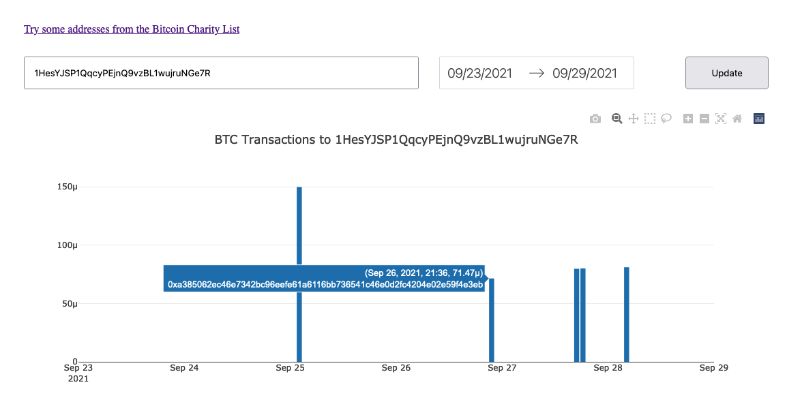

# Time series caching

Sample dashboard application to demonstrate practical time series caching with Python and Redis. The app shows a plot of all BTC transactions for a specific Bitcoin wallet in a specific date range.




See [roman.pt/posts/time-series-caching/](https://roman.pt/posts/time-series-caching/) for more details and explanation of what's going on inside.


## How to get started

Create a new virtual environment with Python3.9 or newer and install the dependencies.

```shell
python3.9 -m venv env
source env/bin/activate
python -m pip install -r requirements.txt
```

Create a new free account at https://www.anyblockanalytics.com/ that acts as the upstream data source.

Start a local Redis server with Docker compose:

```shell
docker-compose up
```

Copy .env.sample to .env and update the file with ElasticSearch requisites.

```shell
cp .env.sample .env
edit .env
```

Start a new cron job populating the cache in the background

```shell
python ./app.py cron
```

Start a web server.

```shell
python ./app.py server
```

Open the browser for the dashboard: http://127.0.0.1:8050/
